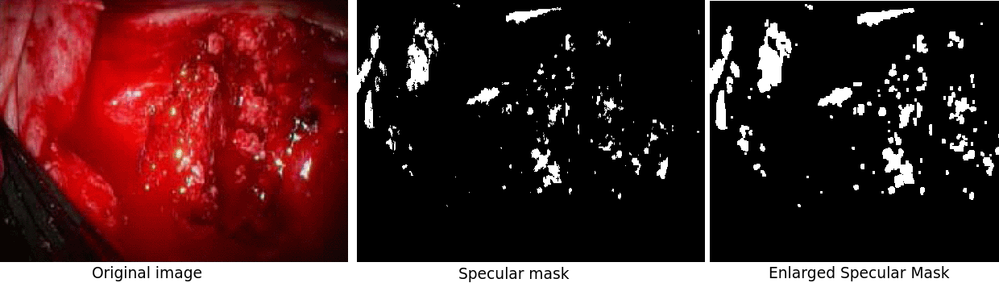
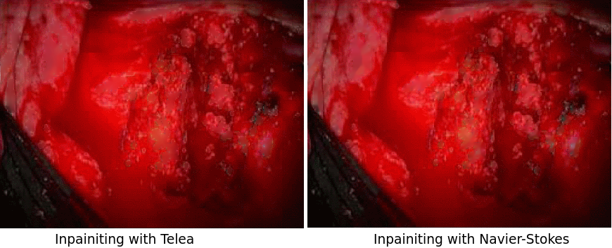

# specularity-removal

This repository contains image processing pipe-line for specularity removal for endoscopic images/videos. A method for extracting specular map was adapted and modified from the study [1, 2, 3]. Unfortunately, the data set used in study [1] is not available to test the repository, yet [Hamlyn](http://hamlyn.doc.ic.ac.uk/vision/) endoscopic videos were processed to implement detection and removal methods.

```python
    # Detection and removal based on study [1].
    # Note that notations (r_, m_, s_) are adapted from the paper.
    import cv2
    import numpy as np
    import specularity as spc  

    impath = 'figs/original.png'
    img = cv2.imread(impath)
    gray_img = spc.derive_graym(impath)

    r_img = m_img = np.array(gray_img)

    rimg = spc.derive_m(img, r_img)
    s_img = spc.derive_saturation(img, rimg)
    spec_mask = spc.check_pixel_specularity(rimg, s_img)
    enlarged_spec = spc.enlarge_specularity(spec_mask)
    
    # use opencv's inpaint methods to remove specularity
    radius = 12 
    telea = cv2.inpaint(img, enlarged_spec, radius, cv2.INPAINT_TELEA)
    ns = cv2.inpaint(img, enlarged_spec, radius, cv2.INPAINT_NS)

```
Below images illustrate the processing steps to detect and enlarge the specular region from a given endoscopic image. Note that this image obtained from the study [1].

Obtained results via performing Telea and Navier-Stokes methods. It should be mentioned that a different algorithm was performed by the study in [1].



**Reference**  
[1] S. Tchoulack, J. M. Pierre Langlois and F. Cheriet, "A video stream processor for real-time detection and correction of specular reflections in endoscopic images," Circuits and Systems and TAISA Conference, 2008. NEWCAS-TAISA 2008. 2008 Joint 6th International IEEE Northeast Workshop on, Montreal, QC, 2008, pp. 49-52.  
[2] Bertalmio, Marcelo, Andrea L. Bertozzi, and Guillermo Sapiro. "Navier-stokes, fluid dynamics, and image and video inpainting." In Computer Vision and Pattern Recognition, 2001. CVPR 2001. Proceedings of the 2001 IEEE Computer Society Conference on, vol. 1, pp. I-355. IEEE, 2001.  
[3] Telea, Alexandru. "An image inpainting technique based on the fast marching method." Journal of graphics tools 9.1 (2004): 23-34.
